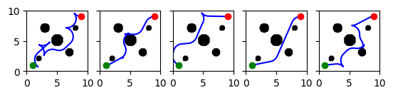

# RRT w/ Reeds-Shepp State Space
*Benjamin Aziel*



Python dependencies are managed with [uv](https://docs.astral.sh/uv/). Install it if you don't have it:

```bash
curl -LsSf https://astral.sh/uv/install.sh | sh
```

Then set up the environment:

```bash
uv sync
```

The pip `ompl` package doesn't include `ReedsSheppStateSpace`, but building from source isn't too bad.

```bash
sudo apt install castxml

git clone https://github.com/ompl/ompl.git
cd ompl
git submodule update --init --recursive
mkdir build && cd build
cmake .. -DOMPL_BUILD_PYTHON_BINDINGS=ON -DOMPL_BUILD_TESTS=OFF -DCMAKE_BUILD_TYPE=Release -DCMAKE_INSTALL_PREFIX=<path_to_repo>/.venv
make -j$(nproc)
make install

cp ~/ompl/py-bindings/ompl/*.py <path_to_repo>/.venv/lib/python3.10/site-packages/ompl/
cp ~/ompl/build/py-bindings/ompl/_ompl.cpython-310-x86_64-linux-gnu.so <path_to_repo>/.venv/lib/python3.10/site-packages/ompl/
```

Verify:

```bash
uv run python3 -c "from ompl import base as ob; print(ob.ReedsSheppStateSpace)"
```
